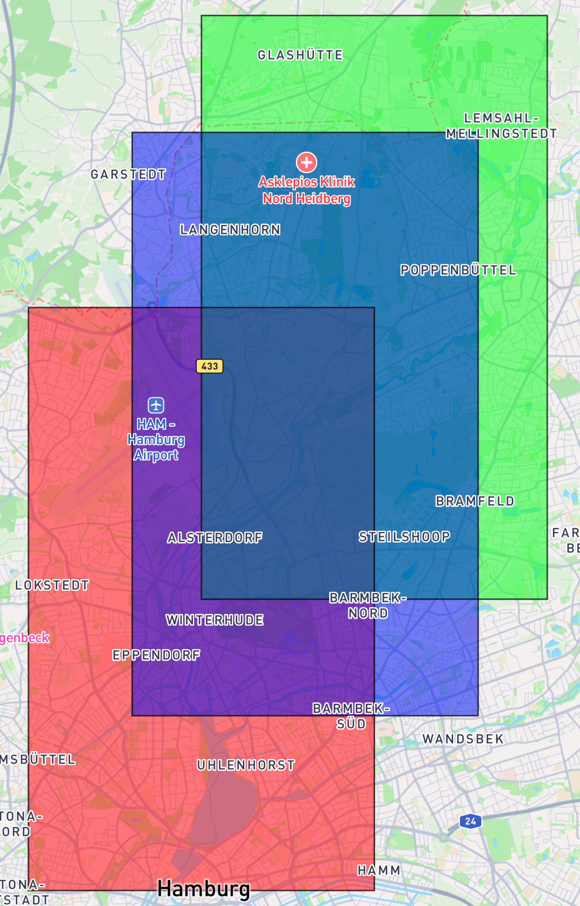
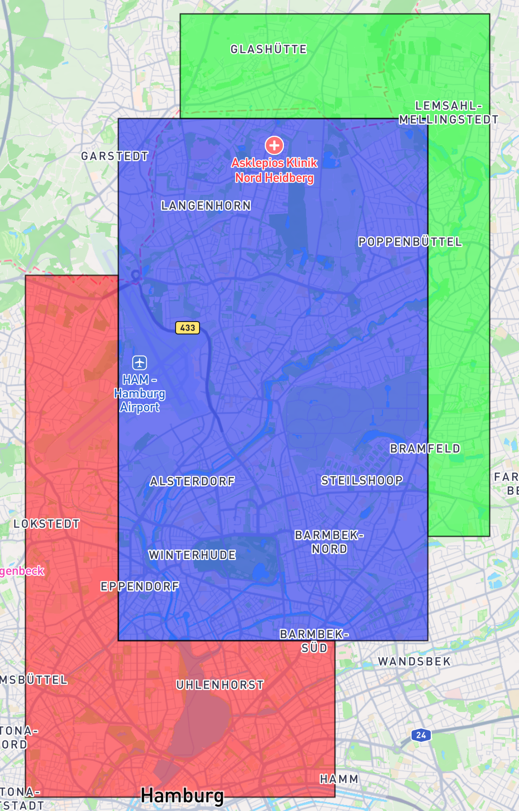

# flatten-geojson
This project illustrates how to flatten overlapping polygons in a GeoJSON `FeatureCollection`,
ensuring that the attributes of the topmost polygon are preserved in areas where overlaps occur.

## Overview
Below is a visual example showing the input polygons and the resulting flattened output.
The original polygons are layered red, green, and blue — from bottom to top.

<table>
  <tr>
    <td><strong>Input (Overlapping Polygons)</strong></td>
    <td><strong>Output (Flattened Polygons)</strong></td>
  </tr>
  <tr>
    <td></td>
    <td></td>
  </tr>
</table>

The code in [flatten.ts](/src/flatten.ts) demonstrates:
- Defining a custom `TypedPolygon` with attribute `type`
- Processing from topmost to bottom layers
- Subtracting already covered areas to avoid overlaps
- Generating a flattened GeoJSON FeatureCollection

## Usage

### Install all dependencies
```bash
npm install
```

### Run the test
```bash
npm test
```
The test will generate two files in the `geojson/` directory:
`input.geojson` – the original overlapping polygons
`output.geojson` – the flattened polygons, with attributes preserved

### Visualizing the output
To view the polygons on a map:
Open [https://geojson.io](https://geojson.io) in your browser.
Drag and drop either `input.geojson` or `output.geojson` onto the map
Each polygon is styled with color and transparency based on its type property for easier inspection.
